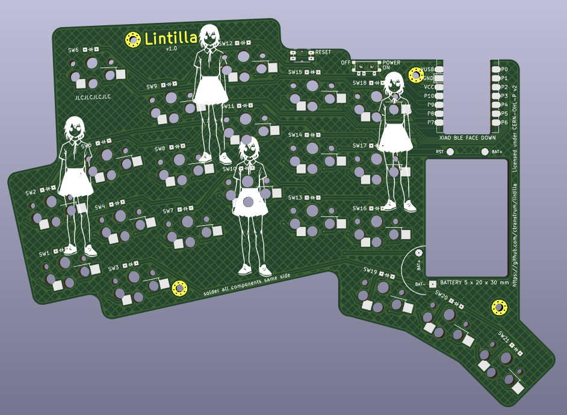

# Lintilla Keyboard

- 42 key wireless ergo keyboard with splay
- Seeed Studio [XIAO BLE][xiao] microcontroller
- Choc v1 hotswap switches
- "Relaxed" choc spacing: a compromise between MX and choc
- Low profile case with space for a "large" 250mAh battery
- [ZMK][zmk] [firmware][firmware]
- Designed with [ergogen][ergogen]
- Licensed under the [CERN Open Hardware License v2][ohl]

[ergogen]: https://ergogen.xyz
[firmware]: https://github.com/ctranstrum/lintilla/tree/zmk
[ohl]: LICENSE.txt
[xiao]: https://wiki.seeedstudio.com/XIAO_BLE/
[zmk]: https://zmk.dev
