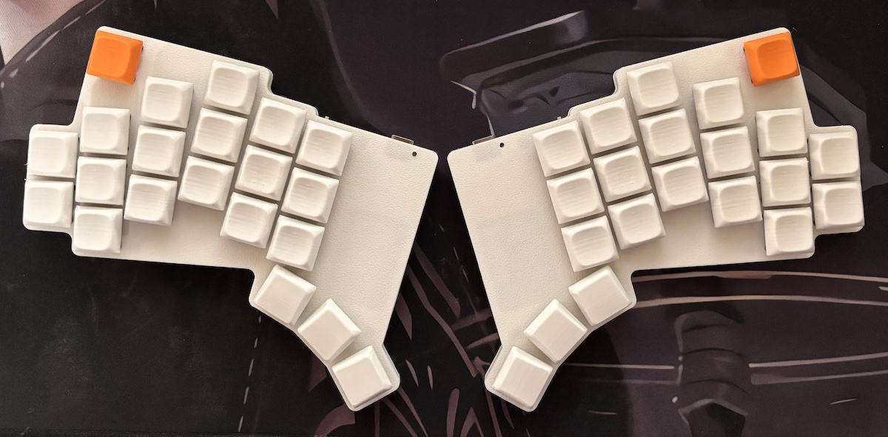
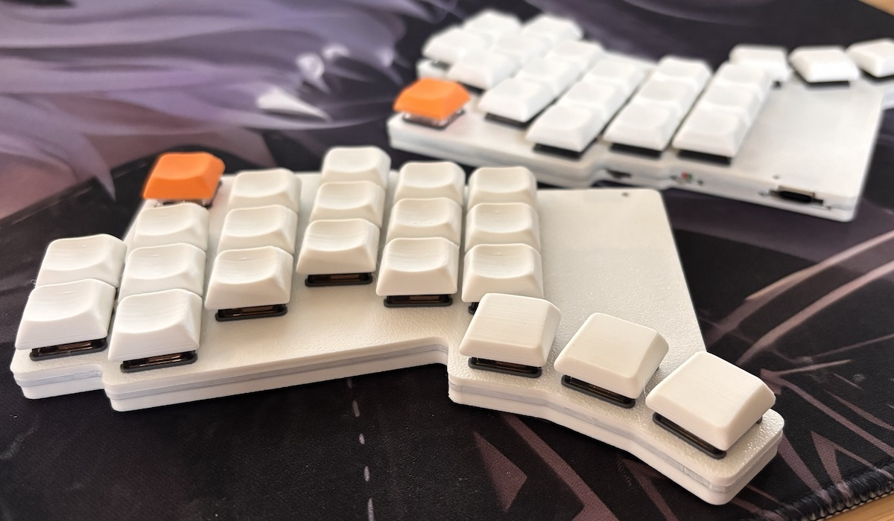
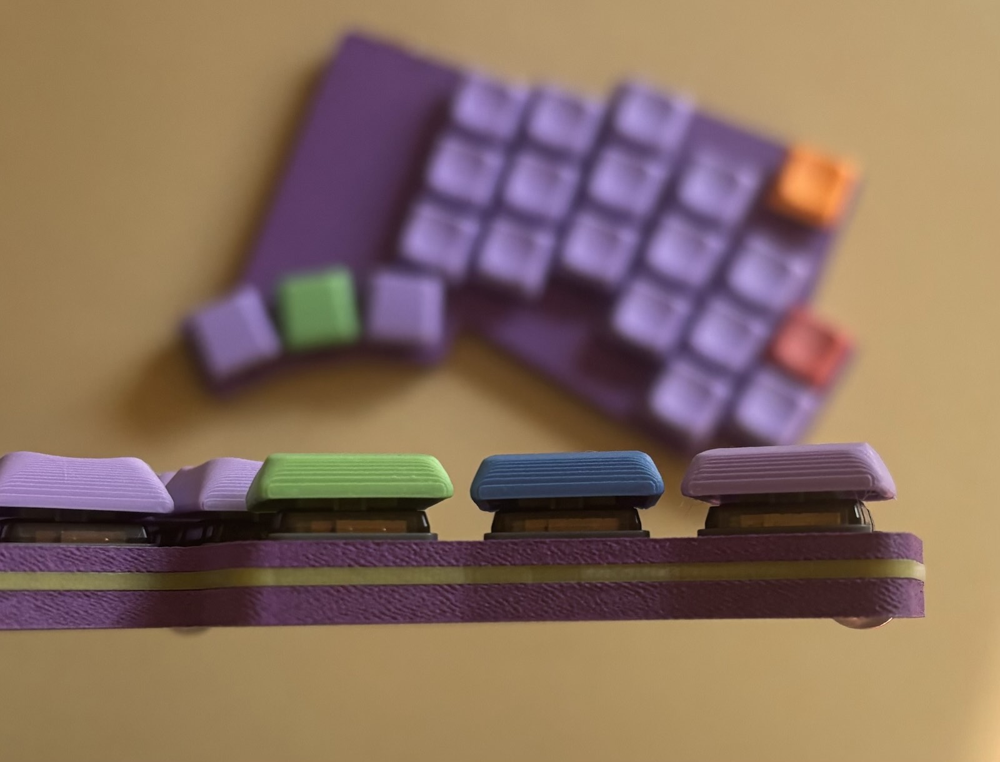

# Lintilla Keyboard

## Features

- 42 key wireless split ergo keyboard with aggressive pinky stagger, splay, and "reachy" thumbs
- Seeed Studio [XIAO BLE][xiao] microcontroller
- Choc v1 hotswap switches
- "Relaxed" (18.5x18) choc spacing: a compromise between MX (19x19) and choc (18x17)
- 7mm low-profile "snug sandwich" case with no exposed components on top or bottom
- [RGB LED status][rgbled] visible on the top of the case
- Wireless-first design using [ZMK][zmk] [firmware][firmware] (including [ZMK Studio][studio])
- Jumperless [reversible](images/pcb-allitnil.jpg) [PCB](images/pcb-lintilla.jpg) designed with [ergogen][ergogen]
- Soldering is simple: SMD components all on a single side of the board for each half
- Internal space (5.4 x 24 x 34 mm) for a "large" 502030 250mAh battery
- Licensed under the [CERN Open Hardware License v2][ohl]
- All source files available, so you can tweak the design if needed

## Design goals

- Low cost wireless
  - xiao ble is only $10 per controller compared to $25 for the nice!nano
  - Reversible PCB for the cheapest manufacturing option (I ordered a set of 5 boards, the minimum order, for under $10)
  - Big battery and an option for a dongle, so you can run for months without recharging
- Ergonomic design for the ultimate comfort
  - split keyboard means you can place each half where it best works for you
  - keys are placed where (my) fingers at rest naturally fall
    - when fingers extend, they splay, so the keys also splay outward to follow the fingers
    - the pinky is shorter than the other fingers, so the pinky keys are placed lower to match
    - unlike most ergonomic boards, the thumb doesn't have to tuck below the palm to reach the thumb keys
  - includes all source files, so if your fingers are slightly different, with a little work you can adjust the keyboard to fit you exactly
- Low profile 3D printable case
  - case is only 7mm high and each side comes in two separate pieces, each largely flat on one side for easy FDM printing with minimal fuss
  - bumpons are inset into the case 1mm to minimize their height; they add only 1/2mm in height
  - choc v1 hotswap switches are some of the shortest commonly available
- Hotswappable
  - keycaps and switches can be easily removed and exchanged so you can fine tune the feel
  - the case is designed to hold tight to the switches, while offering a switch-puller groove that allows for safe and easy removal
- Electrostatic protection
  - unlike other ultra-low-profile cases, no electronics are exposed on either the bottom or the top of the case
  - on the side of the case, the reset button and power switch are available, and the usb port is accessible

## Build Your Own

Think the Lintilla might be right for you? Print out the [fit guide][fitguide] to see how it feels under your fingers.

Want to build one? You will need to obtain the following components:

| Qty    | Description                                                                                    |
| ------ | ---------------------------------------------------------------------------------------------- |
| 2      | identical [Lintilla PCBs][pcb] (can be printed by uploading the [zip file][pcb] to [JLC][jlc]) |
| 4      | [3D printed cases][case], top and bottom for each half                                         |
| 2      | [XIAO BLE][xiao] processors                                                                    |
| 2      | [Panasonic EVQ-PUC02K momentary switches][reset] for the reset button                          |
| 2      | [Alps SSSS811101 SPDT slide switches][power] for the battery on/off                            |
| 2      | [3.7v 250mAh 502030 rechargeable LiPo batteries][battery] (max internal space: 5.4x24x34mm)    |
| 42     | SOD-123 [1N4148W SMD diodes][diodes]                                                           |
| 42     | Kailh [Choc Hot Swap Sockets][sockets]                                                         |
| 42     | [Choc v1 switches][switches] of your choice                                                    |
| 42     | [Choc v1 keycaps][keycaps] of your choice (note: full MX-sized keycaps will be too big)        |
| 8      | [M2 hex nuts][hexnuts]                                                                         |
| 8      | [M2 x 6mm countersunk screws][screws]                                                          |
| 8      | [6mm x 1.5mm bumpons][bumpons]                                                                 |
| ~5-6mm | [1.75mm transparent 3D printer filament][filament] for the "fiber optic" led light guide       |

Once you have these items, you can follow the instructions in the [Build Guide][buildguide].

## Firmware

After you build the keyboard, you will need the [ZMK firmware][firmware].

## What's this about a dongle?

The Lintilla keyboard, with its [LED indicator][rgbled], is perfectly capable of running without a dongle.
With a 250mah battery, the central half should last about 3 months between charges, and the peripheral about six months.

Some people prefer to use a dongle, though, both to allow both halves to last about six months between recharging,
as well as to provide additional feedback on the battery and bluetooth status and currently active layer and modifiers.

I have tested the Lintilla with the following dongles, though you should be able to get any ZMK-compatible dongle to work with it:

- The fancy [Prospector Dongle][prospector]
- The more traditional [OLED Dongle][oled]

Note that while the Lintilla keyboard uses XIAO BLE as its processor, you can use any bluetooth-capable ZMK-compatible processor
on the dongle. If you found a dongle you like, but it uses the nice!nano processor, it should work just fine with Lintilla.

## Credits and inspiration

- [ZMK][zmk]: for the firmware
- [Ergogen][ergogen]: for the tools to quickly iterate over the design
- [Ergonaut One][ergonautone]: for the elegant approach to a xiao-based reversible PCB
- [Klor][klor]: for the almost-perfect key layout

## In the wild

cairn's Lintilla build, using JLC Black Resin for the case, with Nocturnal switches and Chicago Steno keycaps.

Did you build a Lintilla? Send me a photo, and I'd be glad to feature it here.

[battery]: https://ydlbattery.com/products/3-7v-250mah-502030-lithium-polymer-ion-battery
[buildguide]: BUILD.md
[bumpons]: https://www.walmart.com/ip/Small-Door-Bumpers-Self-Adhesive-Clear-Rubber-Feet-Tiny-Bumpons-1-4-Diameter-X-1-16-Thick-100-Pack-u2026/2377364014
[case]: cases/
[diodes]: https://typeractive.xyz/products/smd-diodes
[ergogen]: https://ergogen.xyz
[ergonautone]: https://ergonautkb.com/docs/keyboards/ergonaut-one/intro/
[filament]: https://gizmodorks.com/nylon-filament-200-g-spool/
[firmware]: https://github.com/ctranstrum/lintilla/tree/zmk
[fitguide]: images/fit-guide.pdf
[hexnuts]: https://www.getfpv.com/m2-black-metal-hex-nut-set-of-8.html
[jlc]: https://jlcpcb.com
[keycaps]: https://lowprokb.ca/collections/keycaps/products/ldsa-low-profile-blank-keycaps
[klor]: https://github.com/GEIGEIGEIST/KLOR
[ohl]: LICENSE.txt
[oled]: https://github.com/englmaxi/zmk-dongle-display
[pcb]: pcb/lintilla-gerbers.zip
[power]: https://typeractive.xyz/products/power-switch
[prospector]: https://github.com/carrefinho/prospector
[reset]: https://typeractive.xyz/products/reset-button
[rgbled]: https://github.com/caksoylar/zmk-rgbled-widget
[screws]: https://monsterbolts.com/products/mach-phil-flat-a2-m2?variant=21222571802707
[sockets]: https://typeractive.xyz/products/hotswap-sockets?variant=45742200324327
[studio]: https://zmk.dev/docs/features/studio
[switches]: https://lowprokb.ca/collections/switches/products/ambients-silent-choc-switches
[xiao]: https://wiki.seeedstudio.com/XIAO_BLE/
[zmk]: https://zmk.dev
