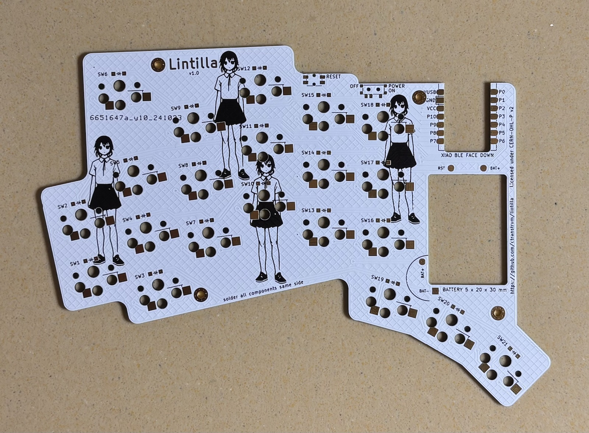

# Lintilla Keyboard

- Seeed Studio [XIAO BLE][xiao]
- 320mah battery
- Choc v1 hotswap switches
- "Relaxed" choc spacing, a compromise between MX and choc
- Low profile case
- [ZMK][zmk] firmware
- Designed with [ergogen][ergogen]
- Licensed under the [CERN Open Hardware License v2][ohl]

[ergogen]: https://ergogen.xyz
[ohl]: LICENSE.txt
[xiao]: https://wiki.seeedstudio.com/XIAO_BLE/
[zmk]: https://zmk.dev
